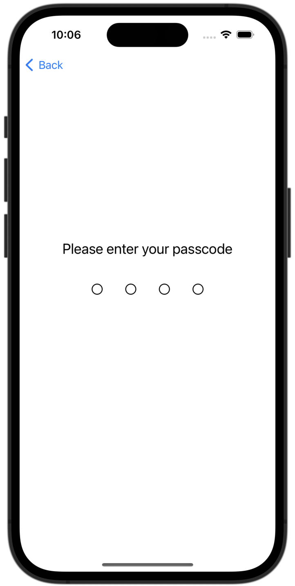
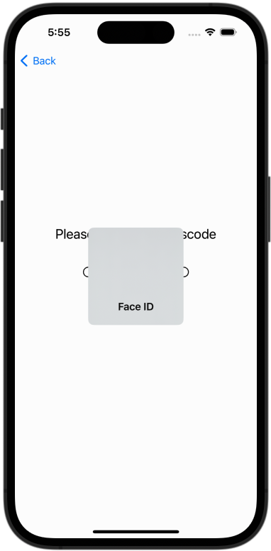

<!--

This source file is part of the Stanford Spezi open-source project.

SPDX-FileCopyrightText: 2022 Stanford University and the project authors (see CONTRIBUTORS.md)

SPDX-License-Identifier: MIT
  
-->

# Spezi Access Guard

[](https://github.com/StanfordSpezi/SpeziAccessGuard/actions/workflows/build-and-test.yml)
[](https://codecov.io/gh/StanfordSpezi/SpeziAccessGuard)
[](https://doi.org/10.5281/zenodo.8332974)
[](https://swiftpackageindex.com/StanfordSpezi/SpeziAccessGuard)
[](https://swiftpackageindex.com/StanfordSpezi/SpeziAccessGuard)

Allows developers to easily guard a SwiftUI view with an access code or biometrics.

|<picture><source media="(prefers-color-scheme: dark)" srcset="Sources/SpeziAccessGuard/SpeziAccessGuard.docc/Resources/AccessGuarded-dark.png"></picture>|<picture><source media="(prefers-color-scheme: dark)" srcset="Sources/SpeziAccessGuard/SpeziAccessGuard.docc/Resources/AccessGuarded-Biometrics-dark.png"></picture>|
|:--:|:--:|
|4-digit Numeric Access Code|Face ID with Access Code Fallback|

## Overview

The Access Guard module allows developers to guard a SwiftUI view with an access code or biometrics and allows users to set or reset their access codes.

For more information, please refer to the [API documentation](https://swiftpackageindex.com/StanfordSpezi/SpeziAccessGuard/documentation).

## Setup

### 1. Add Spezi Access Guard as a Dependency

First, you will need to add the SpeziAccessGuard Swift package to
[your app in Xcode](https://developer.apple.com/documentation/xcode/adding-package-dependencies-to-your-app#) or
[Swift package](https://developer.apple.com/documentation/xcode/creating-a-standalone-swift-package-with-xcode#Add-a-dependency-on-another-Swift-package).

### 2. Register the Access Guard Module

> [!IMPORTANT]
> If your application is not yet configured to use Spezi, follow the [Spezi setup article](https://swiftpackageindex.com/stanfordspezi/spezi/documentation/spezi/initial-setup) to set up the core Spezi infrastructure.

You can configure the [`AccessGuardModule`](https://swiftpackageindex.com/stanfordspezi/speziaccessguard/documentation/speziaccessguard/accessguardmodule) in the [`SpeziAppDelegate`](https://swiftpackageindex.com/stanfordspezi/spezi/documentation/spezi/speziappdelegate) as follows.

#### Access Code

In the example below, we configure the [`AccessGuardModule`](https://swiftpackageindex.com/stanfordspezi/speziaccessguard/documentation/speziaccessguard/accessguardmodule) with one access guard that uses an access code and is identified by `ExampleIdentifier`. The `codeOptions` property defines the type of code used, which in this case is a 4-digit numeric code. The `timeout` property defines when the view should be locked based on the time the scene is not in the foreground, in seconds. 

(Note that the values shown in the example are the defaults for these options and will be applied if they are omitted.)

```swift
import Spezi
import SpeziAccessGuard


class ExampleDelegate: SpeziAppDelegate {
    override var configuration: Configuration {
        Configuration {
            AccessGuardModule(
                [
                    .code(identifier: "ExampleIdentifier", codeOptions: .fourDigitNumeric, timeout: 15 * 60)
                ]
            )
        }
    }
}
```

#### Biometric with Access Code Fallback

The [`AccessGuardModule`](https://swiftpackageindex.com/stanfordspezi/speziaccessguard/documentation/speziaccessguard/accessguardmodule) can also be configured with an access guard that uses biometrics, if the user has either Face ID or Touch ID enabled on their device (see [Face ID](https://support.apple.com/en-us/HT208109) or [Touch ID](https://support.apple.com/en-us/HT201371) for more information). This is shown in the example below. If biometrics are not available or fail, the user will be asked to enter their access code instead.


```swift
import Spezi
import SpeziAccessGuard


class ExampleDelegate: SpeziAppDelegate {
    override var configuration: Configuration {
        Configuration {
            AccessGuardModule(
                [
                    .biometric(identifier: "ExampleIdentifier", codeOptions: .fourDigitNumeric, timeout: 15 * 60)
                ]
            )
        }
    }
}
```

#### Fixed Code

The [`AccessGuardModule`](https://swiftpackageindex.com/stanfordspezi/speziaccessguard/documentation/speziaccessguard/accessguardmodule) can also be configured with a fixed code passed as a string. This is shown in the example below.

```swift
import Spezi
import SpeziAccessGuard


class ExampleDelegate: SpeziAppDelegate {
    override var configuration: Configuration {
        Configuration {
            AccessGuardModule(
                [
                    .fixed(identifier: "ExampleIdentifier", code: "1234")
                ]
            )
        }
    }
}
```

#### Multiple Guards

The [`AccessGuardModule`](https://swiftpackageindex.com/stanfordspezi/speziaccessguard/documentation/speziaccessguard/accessguardmodule) can also be configured with multiple access guards that use different mechanisms, as shown below. In this example, we create both a biometric-based access guard and an access guard with a fixed code that can be used on different views in the application. Note that each access guard must have a unique identifier.

```swift
import Spezi
import SpeziAccessGuard


class ExampleDelegate: SpeziAppDelegate {
    override var configuration: Configuration {
        Configuration {
            AccessGuardModule(
                [
                    .biometric(identifier: "ExampleIdentifier"),
                    .fixed(identifier: "ExampleFixedIdentifier", code: "1234")
                ]
            )
        }
    }
}
```


> [!NOTE]  
> You can learn more about a [`Module` in the Spezi documentation](https://swiftpackageindex.com/stanfordspezi/spezi/documentation/spezi/module).

### 3. Configure target properties

To ensure that your application has the necessary permissions for biometrics, follow the steps below to configure the target properties within your Xcode project:

- Open your project settings in Xcode by selecting *PROJECT_NAME > TARGET_NAME > Info* tab.
- Add a key named `Privacy - Face ID Usage Description` to the `Custom iOS Target Properties` (the `Info.plist` file) and provide a string value that describes why your application needs access to Face ID.

This entry is mandatory for apps that utilize biometrics. Failing to provide it will result in your app being unable to access these features. 

## Examples

### Setting an Access Code

Using [`SetAccessGuard`](https://swiftpackageindex.com/stanfordspezi/speziaccessguard/0.1.1/documentation/speziaccessguard/setaccessguard), we can create a view that allows the user to set their access code. This step must be done before access guards can be used to guard a SwiftUI view, with the exception of an access guard that uses a fixed code.

```swift
import SpeziAccessGuard

struct SetAccessCode: View {
    var body: some View {
        SetAccessGuard(identifier: "ExampleIdentifier")
    }
}
```

### Guarding Access to a SwiftUI View

Now, we can use the [`AccessGuarded`](https://swiftpackageindex.com/stanfordspezi/speziaccessguard/0.1.1/documentation/speziaccessguard/accessguarded) view to guard access to a SwiftUI view with an access code.

```swift
import SpeziAccessGuard

struct ProtectedContent: View {    
    var body: some View {
        AccessGuarded("ExampleIdentifier") {
            Text("Secured content...")
        }
    }
}
```

### Locking an Access Guard

The access guard will lock automatically when it times out. However, we can also lock an access guard directly using the  [`lock(identifier:)`](https://swiftpackageindex.com/stanfordspezi/speziaccessguard/documentation/speziaccessguard/accessguard/lock(identifier:)) method. Here, we add a toolbar item with a button that will lock the access guard.

```swift
struct ProtectedContent: View {
    @Environment(AccessGuard.self) private var accessGuard
    
    var body: some View {
        AccessGuarded("ExampleIdentifier") {
            Text("Secured content...")
        }
        .toolbar {
            ToolbarItem {
                Button("Lock Access Guard") {
                    try? accessGuard.lock(identifier: "ExampleIdentifier")
                }
            }
        }
    }
}
```

### Resetting an Access Guard

To remove the access code and all information from an access guard, we can use the [`resetAccessCode(for:)`](https://swiftpackageindex.com/stanfordspezi/speziaccessguard/documentation/speziaccessguard/accessguard/resetaccesscode(for:)) method. Here, we add a toolbar item with a button that will reset the access guard.

```swift
struct ProtectedContent: View {
    @Environment(AccessGuard.self) private var accessGuard
    
    var body: some View {
        AccessGuarded("ExampleIdentifier") {
            Text("Secured content...")
        }
        .toolbar {
            ToolbarItem {
                Button("Reset Access Guard") {
                    try? accessGuard.resetAccessCode(for: "ExampleIdentifier")
                }
            }
        }
    }
}
```

For more information, please refer to the [API documentation](https://swiftpackageindex.com/StanfordSpezi/SpeziAccessGuard/documentation/speziaccessguard).

## Contributing

Contributions to this project are welcome. Please make sure to read the [contribution guidelines](https://github.com/StanfordSpezi/.github/blob/main/CONTRIBUTING.md) and the [contributor covenant code of conduct](https://github.com/StanfordSpezi/.github/blob/main/CODE_OF_CONDUCT.md) first.


## License

This project is licensed under the MIT License. See [Licenses](https://github.com/StanfordSpezi/SpeziAccessGuard/tree/main/LICENSES) for more information.


